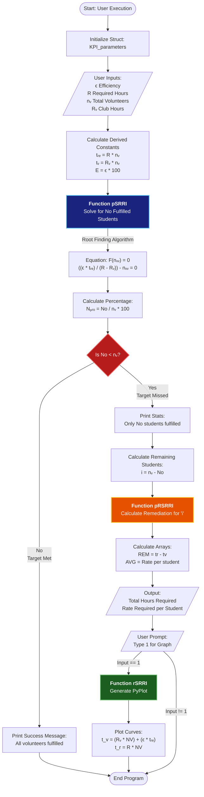

```mermaid
graph TD
    %% --- Setup & Inputs ---
    Start([Start: User Execution]) --> Init[Initialize Struct: KPI_parameters]
    Init --> Input[/User Inputs:<br/>ϵ Efficiency<br/>R Required Hours<br/>nᵥ Total Volunteers<br/>Rᵥ Club Hours/]
    Input --> Const[Calculate Derived Constants<br/>tᵣₑ = R * nᵥ<br/>tᵥ = Rᵥ * nᵥ<br/>E = ϵ * 100]

    %% --- KPI 1 Execution ---
    Const --> KPI1[<b>Function pSRRI</b><br/>Solve for No Fulfilled Students]
    KPI1 -->|Root Finding Algorithm| Eq1["Equation: F(nᵥᵥ) = 0<br/>((ϵ * tᵣₑ) / (R - Rᵥ)) - nᵥᵥ = 0"]
    Eq1 --> CalcNo[Calculate Percentage:<br/>Nₚᵣₒ = No / nᵥ * 100]

    %% --- Decision Block ---
    CalcNo --> Check{Is No < nᵥ?}

    %% --- Success Path ---
    Check -- No<br/>Target Met --> Success[Print Success Message:<br/>All volunteers fulfilled]
    Success --> End([End Program])

    %% --- Failure/Remediation Path ---
    Check -- Yes<br/>Target Missed --> Failure[Print Stats:<br/>Only No students fulfilled]
    Failure --> CalcI[Calculate Remaining Students:<br/>i = nᵥ - No]
    
    %% --- KPI 3 Execution ---
    CalcI --> KPI3[<b>Function pRSRRI</b><br/>Calculate Remediation for 'i']
    KPI3 --> Eq3["Calculate Arrays:<br/>REM = tr - tv<br/>AVG = Rate per student"]
    Eq3 --> Out3[/Output:<br/>Total Hours Required<br/>Rate Required per Student/]
    
    %% --- KPI 2 Execution (Graph) ---
    Out3 --> Prompt[/User Prompt:<br/>Type 1 for Graph/]
    Prompt -- Input == 1 --> KPI2[<b>Function rSRRI</b><br/>Generate PyPlot]
    KPI2 --> Plot["Plot Curves:<br/>t_v = (Rᵥ * NV) + (ϵ * tᵣₑ)<br/>t_r = R * NV"]
    Plot --> End
    Prompt -- Input != 1 --> End

    %% --- Styling (Dark Mode Optimized) ---
    %% Dark blue fill, bright blue border, white text
    style KPI1 fill:#1a237e,stroke:#4fc3f7,stroke-width:2px,color:#ffffff
    %% Dark orange/amber fill, bright yellow border, white text
    style KPI3 fill:#e65100,stroke:#ffca28,stroke-width:2px,color:#ffffff
    %% Dark green fill, bright green border, white text
    style KPI2 fill:#1b5e20,stroke:#66bb6a,stroke-width:2px,color:#ffffff
    %% Dark red fill, bright red border, white text
    style Check fill:#b71c1c,stroke:#ef5350,stroke-width:2px,color:#ffffff
```
